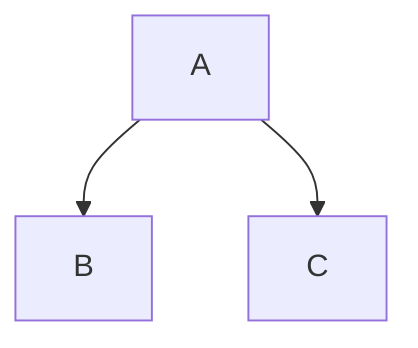

<!-- .slide: data-state="layout-title" class="bg-dark"-->

# GitHub Markdown Additions

> >

Over time GitHub has added improvements to the language that's known as GFM or GitHub Flavored Markdown. Some of these work only with markdown on the website itself and somme will only work in certain places on the site.

Some 

---

# Footnotes

```
This is a footnote[^1]. Another footnote[^2].

[^1]: My reference
[^2]: Another footnote
```

> >

Footnotes are a real interesting addition, theya re sort of like link references, but you add a caret character and a number in the reference.

They also display a bit differently, even though you can add the reference right after the footnote, they will display at the bottom of the page.

---

# Tables
```
| Left  | Center | Right   |
| ----- | :----: | ------: |
| One   | Two    | $1.00   |
| Three | Four   | $120.00 |  
| Five  | Six    | $.99    | 
```

> >

Tables are one of those GitHub additions that it's been added into every other Markdown tool, even though it isn't on the original documentation.

You create tables by using a series of punctuation elements including pipes, hyphens and colons.

The pipes let you separate each cell in a table. You can add a pipe at the beginning or the end of a column, but they're optional. 

White space is normally irrelevant, so most of the time people use it to make the table format nicely.

After the heading, you add cells with hypens for each cell. This starts the cell body.

Table cells left align by default, but you can add colons at each end if you want the cells to display as centered

If you're using the editor on GitHub, you can use the /table command to create a table, which is a great feature. There are a few other slash commands available.

---

# Task List

```md
- [x] First
  - [x] One
  - [ ] Two
- [ ] Second
```

> >

One of the cool new addition in GitHub is the ability to render a checklist, which is available in different places.

You create them by using a list and then adding brackets with a space. If you add an X, then it appears checked.

In some places like projects, they get additional powers that enhance how projects display items and are resortable.

---
# Collapsed Details

```
<details>
<summary>collapsed</summary>

# Header

This is the copy for the collapsed text.
</details>

```

> >

Since you can use most HTML tags, you can take advantage of the details tag to create a collapsed section.

---

# Special Additions

## Drag/Drop/Paste
`.png` `.gif`
`.jpg` `.jpeg` `.svg` `.log` `.docx` `.pptx` `.xlsx` `.txt` `.pdf` `.zip` `.gz` `.tgz` `.mp4` `.mov` `.webm`

## \# and @ mentions

`rgb`, `hex`, `hsl` (`#FABCDE`)

- Emojis with \:
- Escape with \\

---

# Alert Syntax

```
> [!NOTE] 
> A note

> [!IMPORTANT] 
> Important

> [!WARNING] 
> Warning
```

---

# Special Content



[mermaid](https://mermaid.live/) and [others](https://github.blog/changelog/2022-03-17-mermaid-topojson-geojson-and-ascii-stl-diagrams-are-now-supported-in-markdown-and-as-files/)

---

# Disallowed Raw HTML

`<title>`, `<textarea>`, `<style>`, `<xmp>`, `<iframe>`, `<noembed>`, `<noframes>`, `<script>`, `<plaintext>`

> >

Although most HTML tags will work inside the markdown in GitHub, 